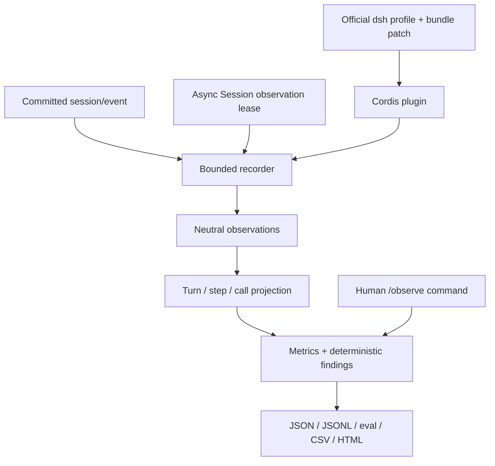

# Architecture

The plugin exports `name`, `inject`, validated `Config`, and `apply`, the official Cordis module form. `package.json.dsh.bundle.patch` inserts its row; no user-facing executable bypasses the official profile launcher. It depends on `sessions` and `sessionQuery`, and optionally attaches to `commands`.

Realtime observations come exclusively from committed durable `session/event`. The live event catalog also exposes `agent/created`, `agent/status`, `agent/request`, `agent/assistant-stream`, `agent/request-error`, `agent/turn-stopping`, and `tools/result`. V1 does not listen to those because durable settlements provide replayable evidence without transient chunk content or waterfall control. Tool pipeline timing is **call-to-result latency**, which includes approval, policy and scheduling; it is not a measurement of body-only execution.

Session seeds emit no realtime event. `ensure()` therefore obtains one immutable asynchronous cut through `sessionQuery.observeSession(..., { projectionMode: 'none' })`, replays its events, and disposes the lease. A bounded bootstrap buffer holds concurrent events until the cut is consumed; sequence deduplication prevents double counting. Reads never use deprecated synchronous Session readers in production. Initializing recorders, pending exports, retained recorders and captured content are bounded.

`TraceRecorder` converts typed Harness events to a neutral envelope with Session identity, seq, timestamp, turn/step and correlation identity. It copies no raw data object into the output. Each recorder uses a fresh HMAC key for argument equality; redacted payloads are fingerprinted with SHA-256. Report snapshots are detached so callers cannot mutate the retained recorder.

Calls correlate by **turn + step + call ID**, so parallel completion order and ID reuse across steps are safe. A surface replacement is a historical projection operation, not an additional tool completion. Child traces retain inherited observations with `inherited: true`, while metrics and findings fold only child-owned evidence. Restart markers do not add task time. No mutation of the source log or derived model history occurs.

Automatic export batches at turn boundaries and Session flush. I/O failure records a safe diagnostic and logs a generic warning; it does not throw into the Agent checkpoint. Explicit human export rejects or returns a command error so the user sees the failure. Existing exported files survive interrupted write-then-rename operations. A hard process loss before export can lose the newest interval.

All `ctx.on`, `ctx.inject`, service and child-plugin contributions are Cordis effects. Disposal stops acceptance, drains pending export, aborts/joins bootstrap reads, and releases retained state. Dispose/remount reconstructs from canonical evidence instead of carrying module-global mutable state. Source-watcher HMR is not a separately tested compatibility promise.

The stable adapter exit is `Trace` schema `1.0`, exported from `./analysis`. Adding remote exporters or new judges requires separate opt-in code; V1 sends no network traffic. Pure `detect(trace, options)` and serializer functions are replaceable extension points, suitable for a future cross-agent observatory.
